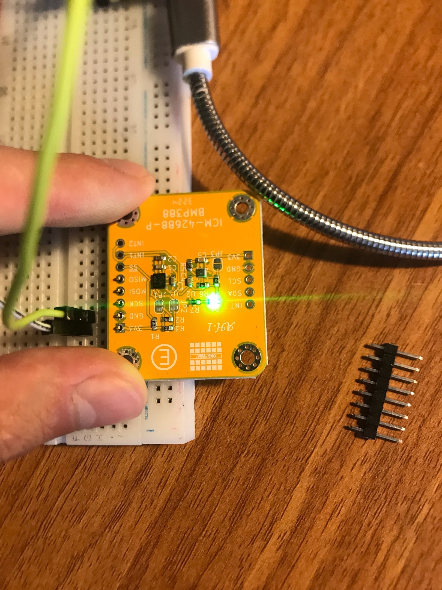

# AH1 development module for ICM-42688-P & BMP388
- Allows to communicate with ICM-42688-P via SPI and I2C
- Allows to communicate with BMP388 via I2C
## Libraries
- [Barsotion ICM-42688-P C-driver](https://github.com/Barsy-Barsevich/ICM42688_Barsotion)
- [Barsotion BMP388 Arduino library](https://github.com/Barsy-Barsevich/BMP388_Barsotion)

## Topology

